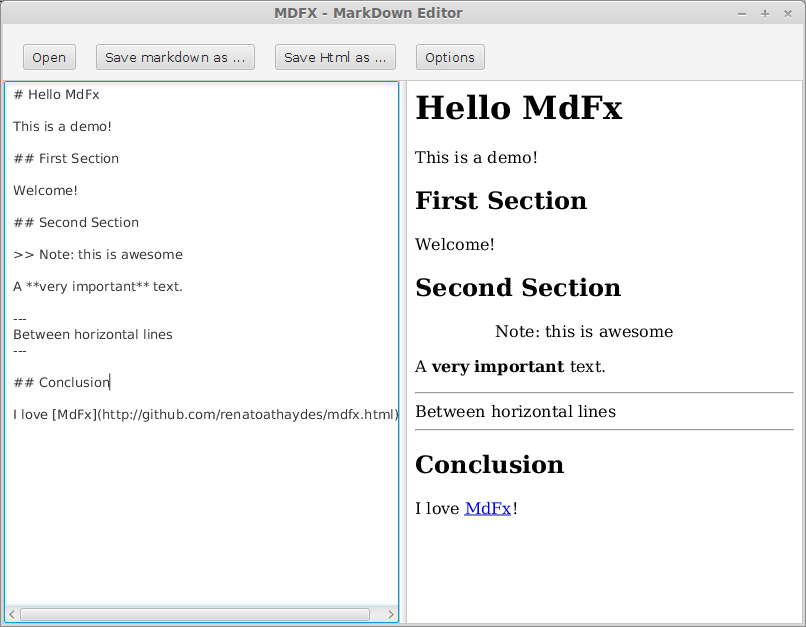

# MdFx
> A markdown editor and markdown -> html converter

## Download

Please choose which version you want to download from the [downloads section](releases/).

All Operating Systems use the same distribution.

## Running MdFx

Requires [Java 8](http://www.oracle.com/technetwork/java/javase/downloads/jre8-downloads-2133155.html).

After downloading the zip, extract it anywhere you want, then double-click on the jar file or open a terminal and type:

```
java -jar mdfx.jar
```

## Screenshot



